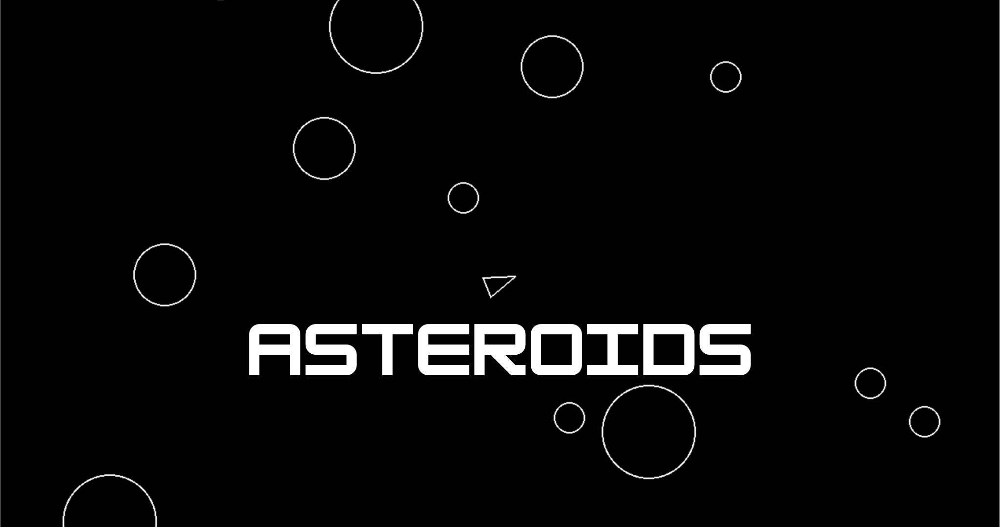

# Asteroids

This is the Pygame version of the hit arcade classic Asteroids.

## Tech stack
- UV (package manager)
- Pygame (game engine)
- Venv (virtual environment, locks game to Python v3.13)

## Player Controls
- `W`: move forward
- `S`: move backward
- `A`: rotate left
- `D`: rotate right 
- `Space`: shoot

## How to play
1. Make sure all packages in tech stack are installed (including Python v3.13)
2. Clone this repository
3. Start game with `uv run main.py`
4. Game should load automatically and a window should appear. Enjoy!
